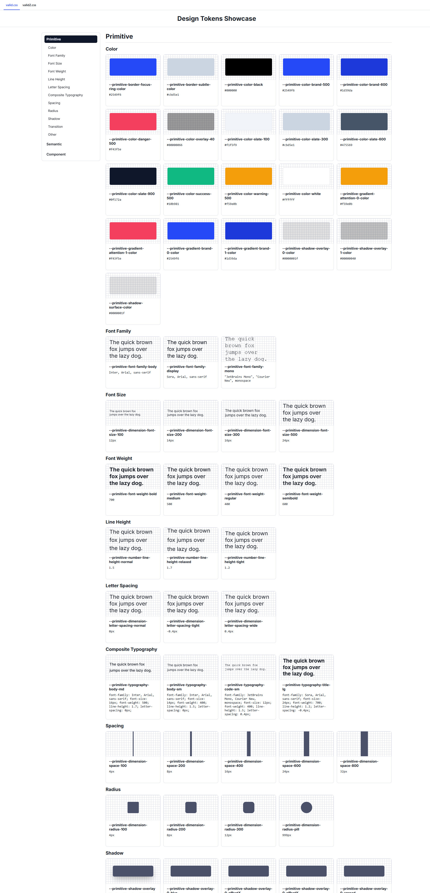

# Design token tools (dtcg-tools)

`dtcg-tools` is a CLI for validating, converting, and previewing DTCG 2025.10
design tokens.

It validates JSON design token files according to the DTCG 2025.10 format using
several engines: `ajv`, `terrazzo`, and `dispersa`.

After validation, the tool can convert tokens to CSS variables using `dispersa`.
It can also generate a static HTML showcase from CSS variables, so you can
quickly check how the generated tokens look visually.

## Main features

- Validate DTCG 2025.10 JSON design tokens.
- Use one or several validation engines.
- Validate files or input from `stdin`.
- Convert valid tokens to CSS variables.
- Generate an HTML showcase from CSS variables.
- Preview generated CSS tokens in the browser when `--output` is used in `showcase` or `build`.
- Run validate -> convert -> showcase in one command.
- Run directly with `npx`, without global installation.



## Requirements

Node.js >=18

## Quick start

Run without install:

```bash
npx dtcg-tools validate tokens.json
```

Or install globally:

```bash
npm install -g dtcg-tools
dtcg-tools validate tokens.json
```

## Validate

Validate one file (default engine: `dispersa`):

```bash
npx dtcg-tools validate tokens.json
```

Validate multiple files:

```bash
npx dtcg-tools validate tokens.json input-dark.json
```

Use specific engines:

```bash
npx dtcg-tools validate tokens.json --engine ajv
npx dtcg-tools validate tokens.json --engine ajv --engine dispersa
npx dtcg-tools validate tokens.json --engine all
```

Supported engine values:

```text
dispersa (default)
ajv
terrazzo
all
```

## Convert to CSS

`convert` validates input before conversion. If validation fails, CSS is not generated.

Print CSS to stdout:

```bash
npx dtcg-tools convert tokens.json
```

Write CSS to a file:

```bash
npx dtcg-tools convert tokens.json --output generated.css
```

Write separate CSS files for multiple inputs:

```bash
npx dtcg-tools convert input1.json input2.json --output output1.css --output output2.css
```

When `--output` is repeated, the number of outputs must match the number of input files.

CSS conversion currently uses:

```text
dispersa
```

## Showcase CSS tokens

Generate static HTML showcase from CSS variables.
By default, without `--output`, HTML is printed to stdout:

```bash
npx dtcg-tools showcase input.css
```

Generate one showcase with tabs for multiple CSS files:

```bash
npx dtcg-tools showcase light.css dark.css
```

For file inputs, tab labels are file names. For stdin, labels are `showcase1`, `showcase2`, and so on.

Generate showcase from stdin (no flags):

```bash
cat input.css | npx dtcg-tools showcase
```

Write showcase HTML to a file:

```bash
npx dtcg-tools showcase input.css --output showcase.html
```

When `--output` is provided:

- if only file name is passed (for example `showcase.html`), it is written to a temporary directory;
- if file path is passed, it is written to that path;
- generated file is opened in the default browser.

## Build pipeline

Run validate -> convert -> showcase in one command.
`build` uses the default validation engine `dispersa`.
By default, without `--output`, HTML is printed to stdout:

```bash
npx dtcg-tools build tokens.json
```

Write final showcase HTML to file:

```bash
npx dtcg-tools build tokens.json --output showcase.html
```

When `--output` is provided, behavior is the same as `showcase`:

- only file name -> file in temporary directory;
- path + file name -> file at provided path;
- generated file is opened in the default browser.

Build pipeline from stdin:

```bash
cat tokens.json | npx dtcg-tools build
```

## Stdin

Validate from stdin:

```bash
cat tokens.json | npx dtcg-tools validate
```

Convert from stdin:

```bash
cat tokens.json | npx dtcg-tools convert
```

Showcase from stdin:

```bash
cat input.css | npx dtcg-tools showcase
```

Build from stdin:

```bash
cat tokens.json | npx dtcg-tools build
```

## License

MIT
